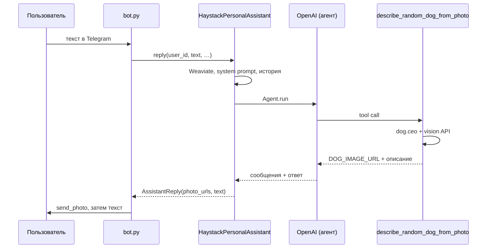

# VPg06: Telegram + Haystack Agent + Weaviate + эмбеддинги (ProxyAPI)

## Краткое описание

**Что делает.** Учебный Telegram-бот — **персональный агент** на **[Haystack](https://haystack.deepset.ai/overview/quick-start)** (`Agent`, tool calling): ответы через **OpenAI-совместимый API** ([ProxyAPI](https://proxyapi.ru/docs/overview)), долговременная память в **[Weaviate Cloud](https://console.weaviate.cloud/)** через **`weaviate-haystack`** ([`WeaviateDocumentStore`](https://haystack.deepset.ai/integrations/weaviate-document-store)), семантический поиск по эмбеддингам. В **Weaviate** сохраняется **только текст сообщений пользователя** (`role=user`); ответы ассистента в базу не пишутся. Краткий контекст диалога — в памяти процесса. Инструменты: факт о кошках (`catfact.ninja`), случайное фото собаки (`dog.ceo`) + описание через **vision**; фото дублируется в чат через `send_photo` (без повторной отправки старых картинок при повторном запросе).

**Как запускать.** `cp .env.example .env`, задать `WEAVIATE_URL`, `WEAVIATE_API_KEY`, `TELEGRAM_BOT_TOKEN`, `OPENAI_API_KEY` (см. `.env.example`). Затем `docker compose up -d --build`. Логи: `docker compose logs -f bot`. Остановка: `docker compose down`.

Исходящие запросы к **Telegram Bot API**, к ProxyAPI и к **Weaviate** идут по **HTTPS**. Входящий HTTP/TLS-сервер приложение **не поднимает** — бот работает через **long polling** ([pyTelegramBotAPI](https://github.com/eternnoir/pyTelegramBotAPI)).

Структура кода согласована с [Guide](https://github.com/SpiritWalker84/Guide) (`docs/conventions/`).

## Стек

Python **3.12**, **haystack-ai**, **weaviate-haystack**, **weaviate-client** v4, **OpenAI SDK**, **pyTelegramBotAPI**, **requests**, **python-dotenv**, Docker / Compose.

## Структура

| Путь | Назначение |
|------|------------|
| `src/vpg05/config.py` | Загрузка настроек из `.env` |
| `src/vpg05/haystack_assistant.py` | Weaviate (Haystack), эмбеддинги, Agent, память |
| `src/vpg05/tools_external.py` | Инструменты: `fetch_random_cat_fact`, `describe_random_dog_from_photo` (+ константы `TOOL_NAME_*`) |
| `src/vpg05/bot.py` | Telegram-бот (long polling) |
| `main.py` | Точка входа для контейнера и локального запуска |
| `.env.example` | Переменные окружения |
| `docker-compose.yml`, `Dockerfile` | Запуск бота в контейнере |
| `tests/` | Pytest (`test_memory_policy.py` и др.) |

## Запуск

### Docker Compose (основной способ)

```bash
cp .env.example .env
# WEAVIATE_URL, WEAVIATE_API_KEY, TELEGRAM_BOT_TOKEN, OPENAI_API_KEY

docker compose up -d --build
docker compose logs -f bot
```

Контейнер: `python main.py` (в образе `PYTHONPATH=/app/src`).

### Локально

```bash
python3 -m venv .venv && source .venv/bin/activate
pip install -r requirements.txt
cp .env.example .env
PYTHONPATH=src python main.py
```

### Тесты (без Telegram)

```bash
PYTHONPATH=src pytest
```

## Команды бота

| Команда / ввод | Действие |
|----------------|----------|
| `/start` | Приветствие |
| `/help` | Справка |
| Текст (не команда) | Агент + память Weaviate + инструменты по необходимости |

## Путь запроса: пример vision-инструмента (случайная собака)

Ниже тот же сценарий, что в коде: от реплики пользователя до `send_photo` в Telegram. Имя инструмента в API — `describe_random_dog_from_photo` (в модуле зафиксировано как `TOOL_NAME_DESCRIBE_RANDOM_DOG_VISION`).

1. Пользователь пишет в чат, например: «покажи случайную собаку и опиши породу».
2. `bot.on_text` → `HaystackPersonalAssistant.reply`: семантический поиск по Weaviate, сбор системного промпта (там перечислены имена инструментов, см. `haystack_assistant._build_system_prompt`), история сессии.
3. `Agent.run` (Haystack) → модель решает вызвать tool **`describe_random_dog_from_photo`**.
4. Реализация в `tools_external.build_external_tools` → `describe_random_dog_from_photo`: HTTP к dog.ceo, затем OpenAI **vision** по URL картинки; первая строка результата `DOG_IMAGE_URL:…` нужна боту.
5. `reply` в `haystack_assistant` собирает `AssistantReply`: URL извлекаются из tool-сообщений текущего хода, текст ответа очищается от дублирования ссылки.
6. `bot` отправляет фото через `send_photo` по URL, затем текст пользователю.



## Конфигурация

См. **`.env.example`**. `EMBEDDING_DIMENSION` должен совпадать с размерностью векторов (для `text-embedding-3-small` обычно **1536**).

| Переменная | Обязательность | Описание |
|------------|----------------|----------|
| `OPENAI_API_KEY` | да | Ключ ProxyAPI / совместимого API |
| `OPENAI_API_BASE` | нет | По умолчанию `https://api.proxyapi.ru/openai/v1`; запасной ключ `OPENAI_BASE_URL` |
| `OPENAI_CHAT_MODEL` | нет | Модель чата для агента |
| `OPENAI_VISION_MODEL` | нет | Vision для собаки (по умолчанию совпадает с `OPENAI_CHAT_MODEL`) |
| `OPENAI_EMBEDDING_MODEL` | нет | Модель эмбеддингов |
| `EMBEDDING_DIMENSION` | нет | Размерность векторов (**1536** для `text-embedding-3-small`) |
| `WEAVIATE_URL` | да | Endpoint кластера Weaviate Cloud |
| `WEAVIATE_API_KEY` | да | API key Weaviate |
| `WEAVIATE_COLLECTION_NAME` | нет | Имя коллекции (по умолчанию `Vpg06HaystackMemory`; схема задаётся Haystack — не смешивать со старыми классами вроде `Vpg05Memory`) |
| `TELEGRAM_BOT_TOKEN` | да | Токен от [@BotFather](https://t.me/BotFather) |
| `MEMORY_TOP_K` | нет | Сколько документов памяти в системный промпт |
| `CHAT_HISTORY_MAX_MESSAGES` | нет | Лимит сообщений истории в сессии |
| `MAX_AGENT_STEPS` | нет | Лимит шагов агента |
| `LOG_LEVEL` | нет | Уровень логирования (`INFO` по умолчанию) |

Секреты в git не коммитить.

## Проверка задания (кратко)

1. **Память:** в Weaviate только реплики пользователя — см. код и `tests/test_memory_policy.py`.
2. **Контекст:** уникальная фраза в чате → позже вопрос по ней; релевантные фрагменты подставляются из Weaviate.
3. **Инструменты:** запрос факта о кошках; запрос случайной собаки — фото в чат + текст описания (один новый URL за запрос).
